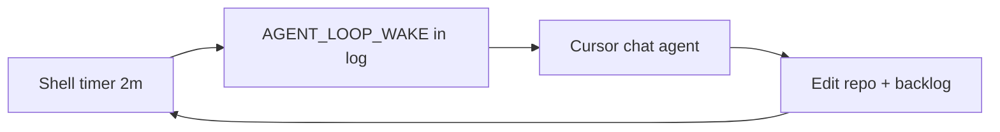

# Continuous improvement loop (Cortex)

**Build → Verify → Polish → Observe** on a timer. Work runs in **this Cursor chat** — the shell loop only emits wakes; the chat agent edits code, UI, and goals.



| Phase | Chat agent does |
|-------|-----------------|
| **Build** | First unchecked item in [cortex-dev-loop.md](./cortex-dev-loop.md) |
| **Verify** | typecheck, lint, docker doctor, health |
| **Polish** | One UI slice from [DESIGN.md](../DESIGN.md) + production UI goals |
| **Observe** | Backlog hygiene + `@task-observer` |

---

## Start (Cursor chat — recommended)

In chat, say **`/loop`** (or `/loop 5m` for a slower cadence). Skill: `@cortex-loop`.

Or from repo root (agent should use **monitored shell** with `notify_on_output` on `AGENT_LOOP_WAKE_cortex_improve`):

```bash
npm run loop              # alias for dev:improve-loop
npm run dev:improve-loop
```

Each wake: chat reads the JSON prompt line and runs that phase. **No** `cursor agent login` required.

Progress: `npm run dev:improve:status` · Stop: `pkill -f cortex-improvement-loop.sh`

### Optional: headless CLI agent (homelab without Cursor open)

```bash
cursor agent login
CORTEX_IMPROVE_EXEC=1 npm run dev:improve-loop
```

---

## Commands

```bash
npm run dev:improve-loop      # timer + wakes (chat executes)
npm run dev:improve:status    # countdown
npm run dev:improve:watch     # live countdown
npm run dev:improve:once      # one wake, no background timer
```

The **2-minute interval** is between wake notifications. Chat work may take longer; overlapping ticks are OK — finish the current phase before starting the next.

---

## Stop

```bash
pkill -f cortex-improvement-loop.sh
```

---

## Phase prompts (agent)

The script stores the active phase in:

`~/.local/state/cortex/improvement-loop/state.json`

### Build

1. Read `docs/cortex-dev-loop.md`.
2. Implement the **first unchecked** item (smallest diff that completes it).
3. If API/web changed: `npm run server:deploy` (no sudo).
4. Mark the item `[x]` with a short evidence note.
5. Do **not** commit unless the user asked.

### Verify

1. `cd frontend && npm run typecheck`
2. `cd backend && npm run lint`
3. `npm run server:docker:doctor`
4. `curl -sf http://127.0.0.1:8080/api/health | head -c 400`
5. If Ollama PC configured: note `ollama` + `agentmemory` in health JSON.
6. Fix **only** failures introduced by the last Build pass; otherwise file a new backlog item.

### Polish

1. Read `docs/goal-google-app-polish.md` and `DESIGN.md` (+ `styles-google-workspace.css` for shell).
2. Ship **one** Google Workspace–quality improvement (≤ ~5 files).
3. Run `npm run typecheck` if frontend touched.
4. Do not start Firestore merge or large refactors.

### Observe

1. Invoke `@task-observer` mindset: what blocked, what worked, what belongs in `skill-observations/log.md`?
2. Add at most **one** new unchecked item to `cortex-dev-loop.md` if Verify/Polish found debt.
3. Remove or reword stale backlog lines.
4. **No commits** in Observe unless user asked.

---

## Human rhythm (recommended)

| When | Action |
|------|--------|
| **Daily** (5 min) | Glance `cortex-dev-loop.md`, run `npm run dev:improve:once` if something is stuck |
| **2–3× / week** | Let `dev:improve-loop` run while you work; review diffs before bed |
| **Weekly** | You approve commits; run `/review` + Chrome `/qa` on `:8080` |
| **Monthly** | Re-run `/plan-design-review` against `DESIGN.md`; prune GOALS Phase 7b |

---

## Related automation (already in repo)

| Command | Role |
|---------|------|
| `npm run server:deploy:watch` | Deploy on git/file changes (homelab) |
| `npm run media:overnight-watch` | Media stack health (separate concern) |
| `npm run server:dev-loop` | Legacy: same wake, **Build-only** prompt |

---

## Backlog files

| File | Purpose |
|------|---------|
| [cortex-dev-loop.md](./cortex-dev-loop.md) | Actionable checklist (loop consumes this) |
| [goal-greyhill-brain-knowledge-os.md](./goal-greyhill-brain-knowledge-os.md) | Knowledge / Obsidian / Ollama PC |
| [goal-prompt-production-ready.md](./goal-prompt-production-ready.md) | Production UI shell |
| [GOALS.md](./GOALS.md) | Full product roadmap |

---

*At session end: “Any observations logged?” (`@task-observer`)*
