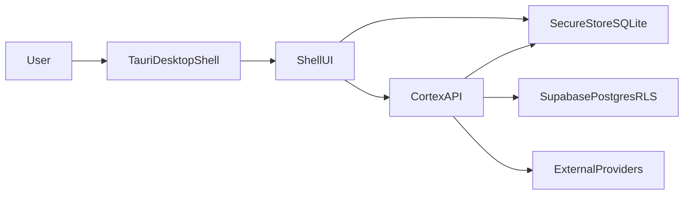

# Cortex System Design (MVP -> Scale)

## 1) Architecture

- Desktop runtime: Tauri shell window acts as desktop overlay host.
- UI runtime: Next.js app (MVP currently bootstrapped as React client) renders lock/home modules.
- API runtime: Node/Express service provides auth/session/lock APIs with zod validation and per-route rate limits.
- Data runtime: Supabase PostgreSQL + RLS is the long-term system of record.
- Local runtime: encrypted secure store + SQLite cache for offline reads and fast startup.



## 2) Component Structure

- `desktop-shell`: Tauri lifecycle, overlay mode, autostart, system commands.
- `auth-module`: login, pin verification, lock/unlock, session checks.
- `shell-home`: pinned app row, command bar, module cards.
- `api-gateway`: auth checks, zod validation, rate limit middleware, route handlers.
- `data-layer`: Supabase repositories + local cache sync jobs.
- `integration-layer`: Gmail, Spotify, Steam, Discord, Anthropic, Obsidian adapters.

## 3) Data Flow

1. Boot -> shell starts -> lock screen visible.
2. Login call validates credentials, returns JWT session token.
3. Unlock call verifies PIN and marks shell unlocked in client state.
4. Module APIs fetch user-scoped data from cache first, then DB/API backends.
5. Idle timeout triggers lock event; user returns to PIN screen.

## 4) API Design (Phase 1 Baseline)

- `POST /api/auth/login` (5/min): email + password -> session token.
- `POST /api/auth/verify-pin` (10/min): pin + bearer token -> unlock.
- `GET /api/auth/session` (30/min): token validity + lock state.
- `POST /api/auth/lock` (10/min): lock current session.
- `POST /api/auth/logout` (5/min): invalidate local session.

Envelope:

```json
{
  "error": {
    "code": "VALIDATION_ERROR",
    "message": "Request validation failed"
  }
}
```

## 5) Database Schema

Primary schema follows `cortex-spec.md`:

- `profiles`, `oauth_tokens`, `app_shortcuts`, `file_rules`, `file_activity`
- `emails`, `ai_conversations`, `ai_messages`, `news_items`, `music_history`, `wiki_pages`
- `user_settings`

RLS: every table filtered to `auth.uid() = user_id` (or conversation ownership for `ai_messages`).

## 6) Caching Strategy

- L1 client cache: Zustand persisted state for fast shell rehydrate.
- L2 local encrypted cache: Tauri secure store + SQLite for offline module reads.
- L3 server cache: Redis (Upstash) for route limits + short-lived API response caching.
- Write-through on mutations: update DB, then refresh local cache asynchronously.
- Staleness tiers:
  - auth/session: no cache
  - launcher/files: 30-120s
  - social/music/email/news: 15-60s
  - AI briefs: generated daily, invalidated on manual refresh

## 7) Implementation Notes (Current Start)

- Backend implemented Phase 1 auth endpoints with route-level rate limiting and zod validation.
- Frontend now has a running lock/login shell scaffold wired to those endpoints.
- Next iteration: replace React/Vite shell with Next.js App Router + Tauri host wiring.

## 8) Supabase MVP Migration Order

For the current integration step, apply only the MVP data-layer migrations:

1. `supabase/migrations/001_initial_schema.sql`
2. `supabase/migrations/002_rls_baseline.sql`

This order is required because the RLS baseline depends on objects created in `001`.
See `docs/supabase-setup.md` for local bootstrap commands and verification checklist.
