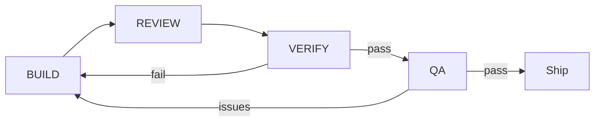

# Cortex multi-team dev cycle

Agents (and humans) run this loop until the app is stable and polished.

## Teams

| Team | Role | When to run |
|------|------|-------------|
| **BUILD** | Implement features and fixes | Every session |
| **REVIEW** | Read-only audit (auth, integrations, Electron, UI) | After BUILD batch |
| **VERIFY** | `tsc`, `npm run build`, `/api/health`, preload format | After REVIEW |
| **QA** | Manual/browser checks (login, Settings chips, widgets) | Before user demo |

## Cycle



1. **BUILD** — Pick items from `docs/agent-progress.md` and open P0/P1 from REVIEW.
2. **REVIEW** — Subagent explores codebase; returns P0/P1/P2 (max ~25 bullets).
3. **VERIFY** — Subagent runs typecheck + builds + health; no file edits.
4. **QA** — User or agent confirms login, integrations panel, Electron preload (no console errors).
5. Repeat until REVIEW has no P0 and VERIFY is green.

## Handoff template (BUILD → REVIEW)

```
Branch: feat/firebase-dashboard-integrations
Changed: [list files/areas]
Goal: [what should work now]
Ask: P0/P1/P2 + what works well
```

## Current focus

- Production dashboard: Notion, Canva, OpenClaw, Firebase app data, n8n
- Auth: OTP + Electron desktop token (secret via main process)
- Electron: CJS preload, health wait, Prisma init on packaged start
- UI: responsive shell, integration chips, accurate OAuth status

Log outcomes in `docs/agent-progress.md` under **Log**.
